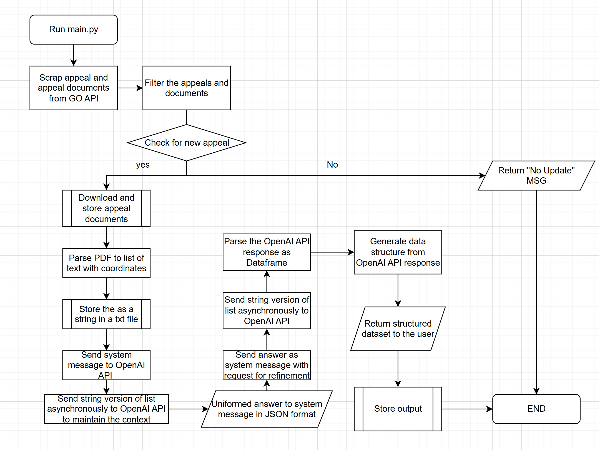
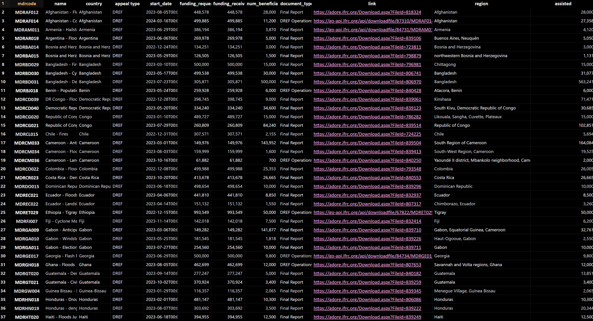
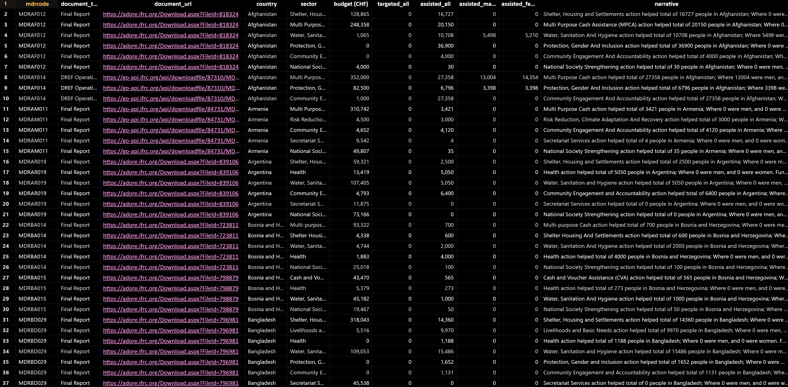

# GOAuTomation (GOAT)

## Overview

GOAT is an Automatic information extraction tool which
downloads PDF appeal documents from the GO database
using GO API and parse specific information from
those documents using NLP and LLM.

---

## Table of Contents

- [Overview](#overview)
- [Installation](#installation)
- [Execution] (#execution)
- [Usage](#usage)
- [Features](#features)
- [License](#license)
- [Contact](#contact)
- [TODO](#todo)
- [OUTPUT](#output)
---

## Installation

1. Clone the repository:
   ```bash
   git clone git@github.com:TKartist/GOAuTomation.git
   ```
2. Install dependencies:
  ```bash
   pip install pandas
   pip install fitz
   pip install openai
   ```

## Execution
  ```bash
   cd GOAutomation
   python main.py
   ```
   - Make sure you are in the `GOAutomation` folder by using `cd` and run the `main.py` file
   - The following flow chart shows the flow of the code execution



## Usage
- the `quantitative_context_extraction()` of the string_manipulation file is focused specifically on numerical data extraction
- Extracting all texts while maintaining their positional value
- Divides textified PDF as pages
- Token calculator (Token is a unit used in LLMs which are equivalent to one variable; it is different from letter, word, or phrase)
  Hence, to avoid issues, token count may play an important role in debugging and understanding the datastream
- Sending asynchronous call to OpenAI API with designated system message and multiple chunks of user message

## Features
- Data extraction from GO platform
- PDF -> .txt file containing phrases with their coordinates
- Asynchronous feeding of the string information to the OpenAI API
- Extraction of information in a uniformed format
- Refining the answer through passing the string again
- Parsing and storing of OpenAI API response
- Generation of structured dataset from all available information
- Auto-handling of generic errors


## TODO
- Establish one command execution of the process
- File and code reformating
- Reduce the token usage (filtering unnecessary information, and output reduction)
- Partially assess the validity of the extracted information through manually constructed DB's `/dref-final-report/` Endpoint


## OUTPUT
- DREF/EA report aggregation



- Sex disaggregation of people assisted through operational strategies carried out during DREF and EA missions

